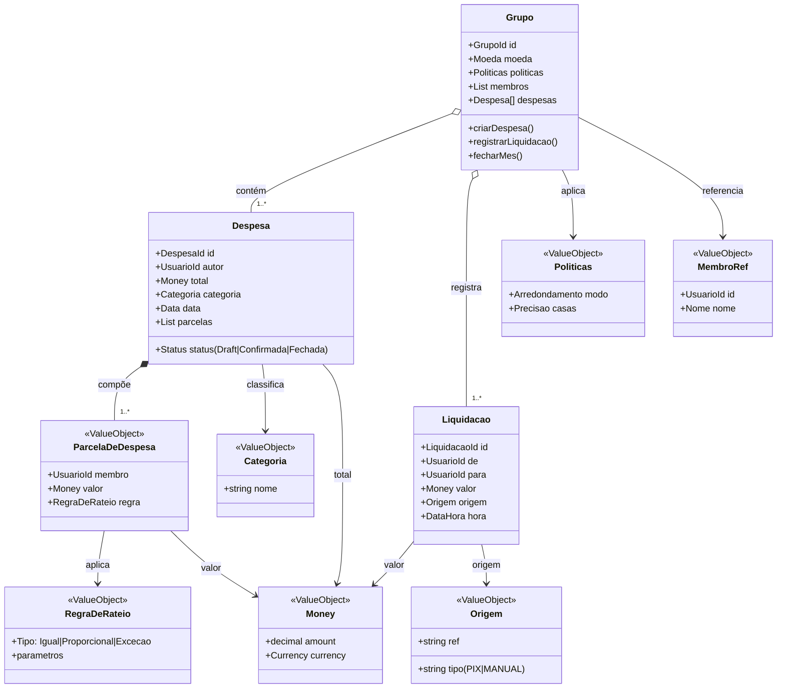

# 📚 Trabalho — Design Tático no DDD

## 🚀 Quick start (5 passos)
1. Escolha um **domínio** que você conheça (ex.: **[Seu Domínio]**).
2. Liste 3–7 **invariantes** que devem estar corretas no **commit**.
3. Escolha 1–2 **Agregados principais** (comece por **[Agregado Principal]**).
4. Desenhe a **máquina de estados** e os **eventos** que surgem das transições.
5. Defina o **Repositório** da AR e como lidará com **consistência** entre agregados.

---

## 🩺 1) Sobre o Domínio Escolhido
**Nome do domínio:** Ledger - Saldos e liquidações  
**Objetivo do sistema:** Mantém o ledger (entradas imutáveis) e projeta saldos por grupo; registra quitações/reversões vindas da liquidação; garante soma-zero e auditabilidade do histórico.  
**Principais atores:** Usuários, sistemas e organizações  
**Contextos (opcional):** **[Contextos/Bounded Contexts propostos]**

---

## 🧩 2) Entidades vs Value Objects
Preencha a tabela justificando cada tipo (identidade vs. imutabilidade).

| Elemento | Tipo (Entidade/VO) | Por quê? (identidade/imutável) |
|---|---|---|
| **Grupo** | Entidade | Centraliza regras e invariantes do grupo, identidade própria e ciclo de vida longo - Mutável (Membros, configurações) |
| **Despesa** | Entidade | Tem identidade, estado (draft, confirmada, fechada ou histórico) - Mutável (Estado pode sair de draft para confirmado e assim subsequente) |
| **Acerto** | Entidade | Representa um evento financeiro único - Imutável (Fato contábil) |
| **Regra de Rateio** | VO | Descreve como dividir as despesas, parâmetros de calculo - Imutável (Comparado com o valor) |
| **Money** | VO | Garante operações monetárias - Imutável |

> Dica: Promova tipos semânticos: `Email`, `CPF/CNPJ`, `Money`, `IntervaloDeTempo`, `Endereco`, `Percentual`, `Quantidade`, etc. **VOs devem ser imutáveis** e com **igualdade por valor**.

---

## 🏗️ 3) Agregados e Aggregate Root (AR)
**Agregado Principal:** **Grupos**  
**AR:** **Grupos**  
**Conteúdo interno do agregado (apenas o necessário para consistência local):**  
- **Despesas (Entidade Interna)**
- **Políticas (Value Objects)**
- **Status (Value Objects)**

**Referências a outros agregados (por ID):**  
- **Membros (Referência de Agregado)**

**Boundary — Por que cada item está dentro/fora?**  
- **Despesa - Dentro porque uma despesa não pode existir fora de um grupo.**  
- **Membros - Fora porque só necessita de referência por ID.**

---

## 🧭 4) Invariantes e Máquina de Estados
Liste invariantes (devem ser verdadeiras ao final de cada transação).

**Invariantes (exemplos):**
- **Toda despesa precisa pertencer a um grupo;**
- **Toda despesa fechada, não poderá ser alterada;**
- **Todo grupo precisa de uma moeda única;**
- **Todo grupo precisa ter o mínimo de dois membros;**
- **Todo grupo precisa estar ativo para receber despesas;**
- **O saldo total do grupo, precisa ser soma-zero.**


**Estados e transições da AR Grupos:**
```
[CriacaoGrupo] -> [InserirDespesa] -> [RegistrarLiquidacao] -> [EncerramentoDoGrupo]
Regras:
- [CriarGrupo] permitida se [dois membros (owner e um membro)]
- [InserirDespesa] permitida se [o grupo estiver ativo]
- [RegistrarLiquidacao] exige [moeda única]
- [EncerramentoDoGrupo] exige [soma-zero; grupo estiver ativo]
```

---

## 🗃️ 5) Repositório do Agregado (interface)
> Repositório trabalha **apenas com a AR**, sem expor entidades internas do agregado. Consultas analíticas ficam fora (read models).

**Linguagem livre** (ex.: C#, Java, Kotlin, TS). Exemplo (C# assíncrono, adapte nomes):
```java

public interface GrupoRepository extends JpaRepository<GrupoEntity, Long>  {
     Optional<GrupoEntity> obterPorIdAsync(Guid id, List<GrupoEntity>);
     void adicionarAsync(GrupoEntity entidade);
     void salvarAsync(GrupoEntity entidade);
}

```


---

## 📣 6) Eventos de Domínio
Defina **2–4 eventos** com **payload mínimo** e **momento de publicação** (preferir **pós-commit**). Diferencie **evento interno** vs **evento de integração**.

| Evento | Quando ocorre | Payload mínimo | Interno/Integração | Observações |
|---|---|---|---|---|
| **DespesaRegistrada** | Após persistir nova Despesa no Grupo | grupoId, despesaId, autorId, total, parcelas[] | Integração | Consumido por Reporting, pode acionar Collections para lembrete automático. |
| **DespesaConfirmada** | Após confirmar uma Despesa draft | grupoId, despesaId, status | Interno | Garante que só despesas confirmadas entram no cálculo de saldos. |
| **SaldoAtualizado** | Após recalcular projeção de saldos no grupo | grupoId, saldos[] {membroId, valor} | Integração | Alimenta projeções em Reporting e UI em tempo quase real. |
| **LiquidacaoRegistrada** | Após registrar uma liquidação/acerto | grupoId, liquidacaoId, de, para, valor | Integração | Usado por Reporting, pode notificar Collections (quem já pagou). |

---

## 🗺️ 7) Diagrama (Mermaid ou ferramenta à sua escolha)
> Mostre **Agregados/AR**, **VOs** e **relacionamentos por ID** entre agregados (não “contenha” outros agregados).

**Exemplo de esqueleto Mermaid:**


---

## ✅ Checklist de Aceitação
- [ ] **VOs imutáveis** e com **igualdade por valor** (nada de “string de CPF/Email”).
- [ ] **Boundary do agregado** pequeno e com **invariantes claras**.
- [ ] **Domínio rico**: operações do negócio como métodos (evitar `set` aberto).
- [ ] **Repositório** focado na **AR** (sem `IQueryable`/detalhes de ORM no domínio).


## 📤 Entrega

- **Inclua**: link/imagem do **diagrama** + todas as seções acima preenchidas.
---
